### Recurrent Neural Network-Based Optimal Sensing Duty Cycle Control Method for Wireless Sensor Networks

[**2021.04 *ICAIIC* 국제학술대회 발표**](https://ieeexplore.ieee.org/abstract/document/9415235)

[**2021.09  *IEEE ACCESS* 논문지(SCI) 게재**](https://ieeexplore.ieee.org/document/9540599)  

**2021.09 특허 출원**

#### :heavy_check_mark:핵심  

기간 :  2020/07 - 2021/09   

프로젝트 요약 : 최근 사물 인터넷의 발전에 따라 기술의 근간이 되는 무선 센서 네트워크의 발전 역시 중요시되고 있다. 일반적으로 무선 센서 네트워크에서 센서들의 에너지원으로 배터리가 사용되기 때문에 높은 에너지 효율성은 센서의 수명을 더 길게 만들고 에너지 하베스팅과 같은 간섭에서 자유롭게 한다. 모바일 객체 추적은 무선 센서 네트워크가 사용되는 분야 중 하나이다. 모바일 객체 추적 네트워크에서 에너지 효율성을 높이기 위해 센서의 비활성화 상태가 길어지면 객체 감지에 대한 성능이 감소하는 문제가 생긴다. 반면에 센서의 활성화 상태를 길게 하면 네트워크의 수명이 짧아지기 때문에 두 요소의 적절한 합 의점을 찾는 것이 중요하다. 따라서 본 논문에서는 최적화된 듀티사이클 조절 방법을 제안하고 순환 신경망 모델을 사용하여 센서의 최적의 듀티사이클을 예측한다.

역할 : 지도 교수님의 지도를 받은 단독 연구  

* 에너지 효율성과 객체 추적 정확성, 트레이드 오프 관계인 두 문제를 최적화 하기 위해서 필요한 상황에 대해 생각해보았다. 그리고 이 상황을 수학적으로 유도하여 시스템 모델 구현에 적용하였다. 

* 실제 상황에서 객체가 센서 노드에 들어가고 나오는 정확한 시간을 예측하기는 어렵다. 예측하는 것을 성공하더라도 이 값을 이용하여 다음 센서 노드의 최적 상태에 대해 도출하는 것은 쉽지 않은 일이다. 따라서 이를 예측하는 딥러닝 모델을 구현하고자 하였다. 

* 딥러닝 모델의 경우, 지도 학습을 사용하기 때문에 입력과 출력 데이터셋이 필요하다. 앞서 말한대로 실제 상황에 객체가 센서 노드에 들어가고 나오는 정확한 시간을 예측하기는 어렵기 때문에 이를 추출할 수 있는 가상의 디지털 트윈을 구현하였다. 
  * 디지털 트윈에는 센서 노드의 배치, 객체 이동 모델, 제안한 최적 듀티 사이클 모드 산출 방법 등이 반영되어있다. 
  * 이를 Matlab을 이용하여 구현하였는데 이는 Matlab이 시뮬레이션, 그래프 등을 시각화하는 것에 특화된 플랫폼이기 때문이다. 
  * Python에도 Matplotlib이라는 라이브러리가 존재하지만 화질 저하 등의 문제가 있어서 Matlab 환경에서 구현을 진행하였다.

* 딥러닝 모델의 경우 Python에서 Keras 라이브러리를 이용하여 구현하였다. 
  * Tensorflow의 경우에는 조금 더 low한 레벨에서 신경망을 구현할 수 있기 때문에 신경망 모델을 섬세하게 튜닝하고 싶은 경우에 적합하다. 
  * Keras의 경우에는 Tensorflow 위에서 동작하는 라이브러리로 상대적으로 사용자 친화적이기 때문에 직관적인 특성이 있다. 성능 좋은 딥러닝 모델을 개발하는 것에 목적이 있지 않고 상황을 해결하는 방법 중 하나로 딥러닝을 선택한 것이기 때문에 Keras로도 충분하다고 생각했다. 그리고 Keras으로도 다양한 딥러닝 모델(bi-LSTM 등)을 적용해볼 수 있다고 판단하였다. 

* LSTM 모델을 이용하여 딥러닝 모델을 구현하였다.
  * sequential data가 입력으로 들어오는 상황을 고려했기 때문에 이에 특화된 RNN 모델이 적합하다고 생각했다.
  * vanila RNN 모델의 경우에는 gradient descent 문제가 심각하기 때문에 LSTM 모델을 사용하였다.

* Numpy를 이용하여 LSTM 모델의 입력과 출력 구조로 데이터셋 전처리 과정을 진행했다.
  * Matlab은 2차원까지 지원하기 때문에 python으로 데이터를 옮길 때 전처리 과정이 필요하게 되었다.
  * LSTM 모델의 입력에는 각각의 센서 노드의 위치, 객체 감지 여부가 1차원을 이룬다. 그리고 각각의 1차원이 sequence length 길이만큼 2차원을 이룬다. 마지막으로 데이터셋의 개수만큼 각각의 2차원이 3차원을 이룬다. Numpy를 이용하여 2차원이던 데이터 구조를 3차원으로 수정하는 전처리 과정을 진행했다.

* LSTM 모델의 성능을 개선하기까지 매우 오랜 정체 과정을 겪었는데 포기하지 않고 문제의 원인에 대해서 분석하고 관련 자료를 찾아보는 끈기를 발휘하였다.

 

#### :heavy_check_mark: 프로젝트 정리  

#### contribution

* 무선 센서 네트워크의 센서가 움직이는 객체에 대해서 최소 감지 조건을 만족할 수 있도록 최적의 듀티 사이클을 조절하는 메커니즘을 제안한다.

* 지도 학습을 사용하는 RNN의 학습 데이터를 생성하기 위해 디지털 트윈을 구현한다. 디지털 트윈에서 센서는 움직이는 객체에 대해서 제안된 듀티 사이클 조절 메커니즘을 만족하며 동작하도록 구현한다.

* 디지털 트윈을 통해 추출된 데이터를 이용하여 객체의 움직임에 따라 최적의 듀티 사이클을 예측할 수 있도록 RNN 모델을 학습시키고 결과를 확인한다. 

 

#### 논문 정리

 

#### 객체 이동 모델 구현 및 제안한 최적 듀티 사이클 모드 산출 방법이 반영된 디지털 트윈 구현  

* 객체 이동 모델에 대한 조사  
  * 아래는 객체 이동 모델에 대해서 찾아본 결과이다. 이후에 모델을 수정하게 되지만 Random Waypoint Model을 이용하는 것이 좋겠다고 판단하고 시뮬레이션 구현을 시작했다.

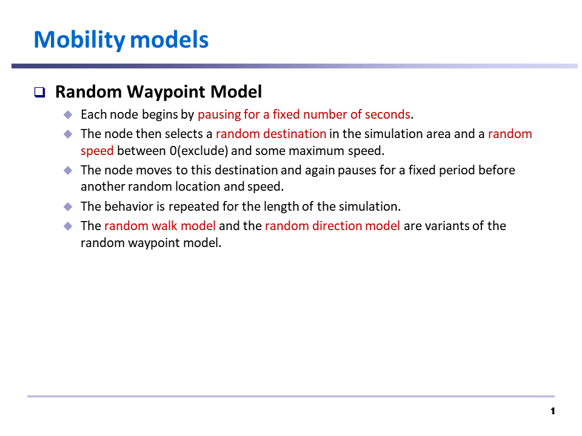  
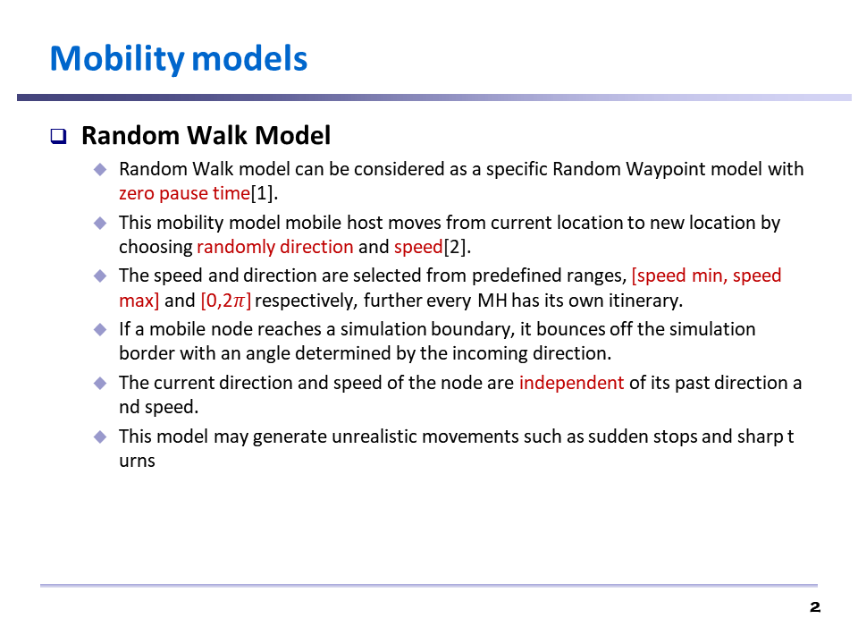  
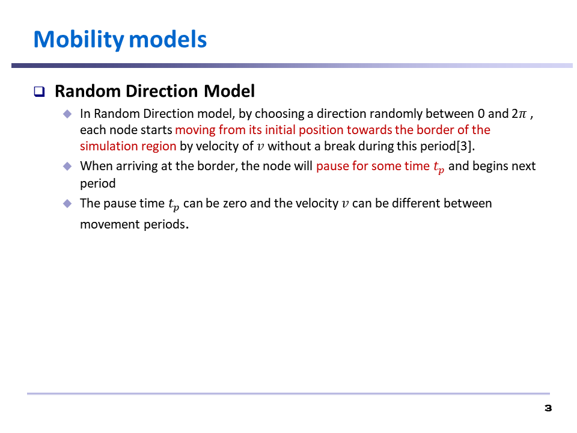  
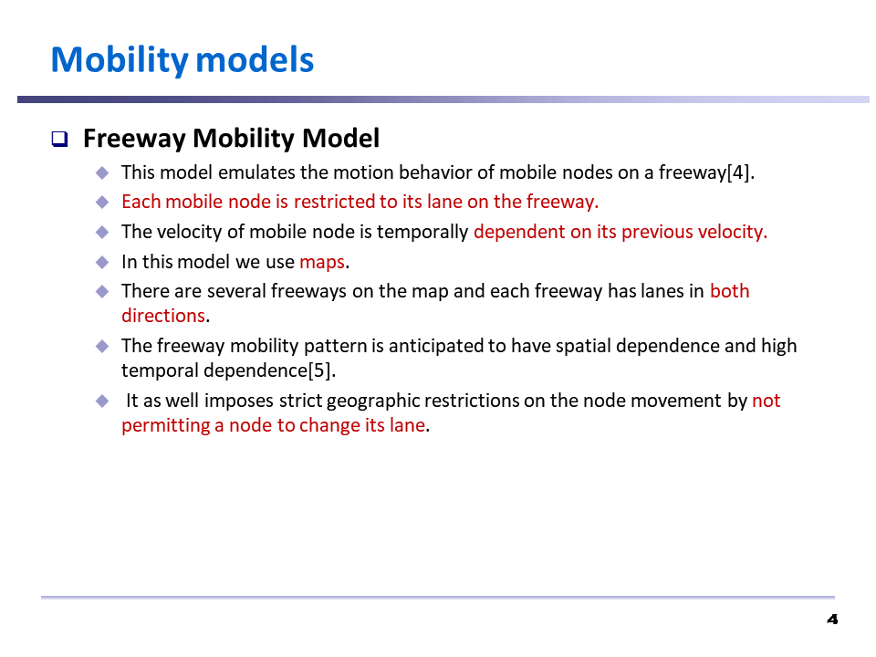  
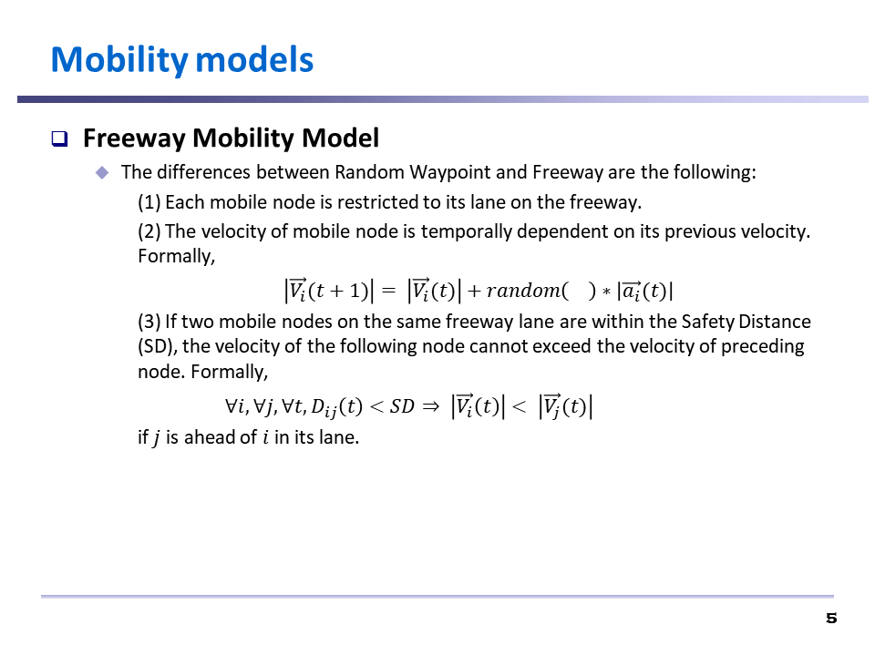  
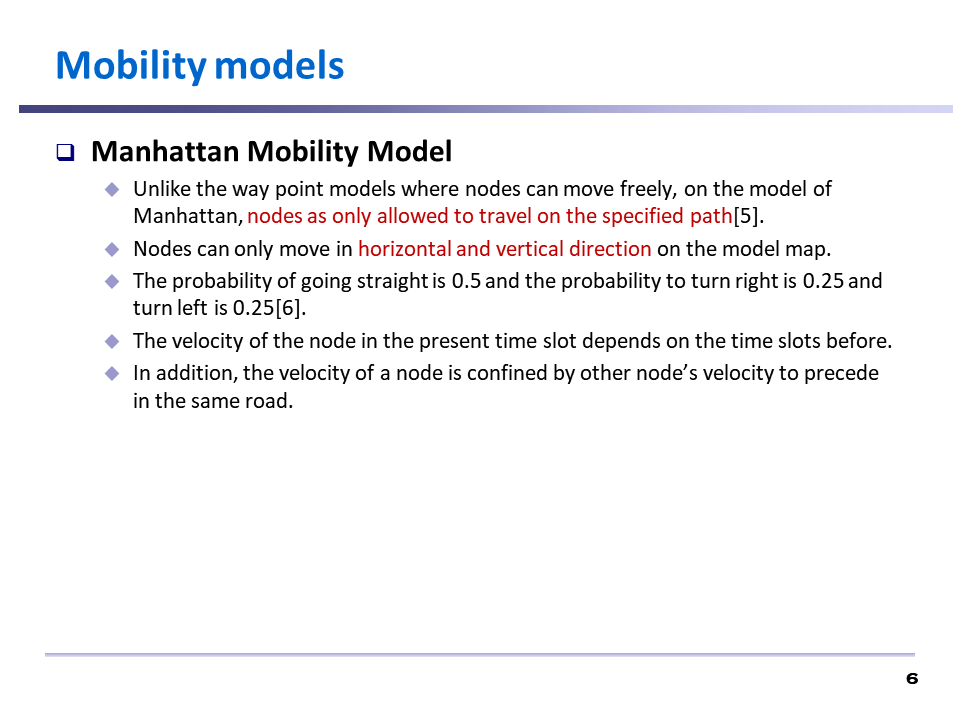  
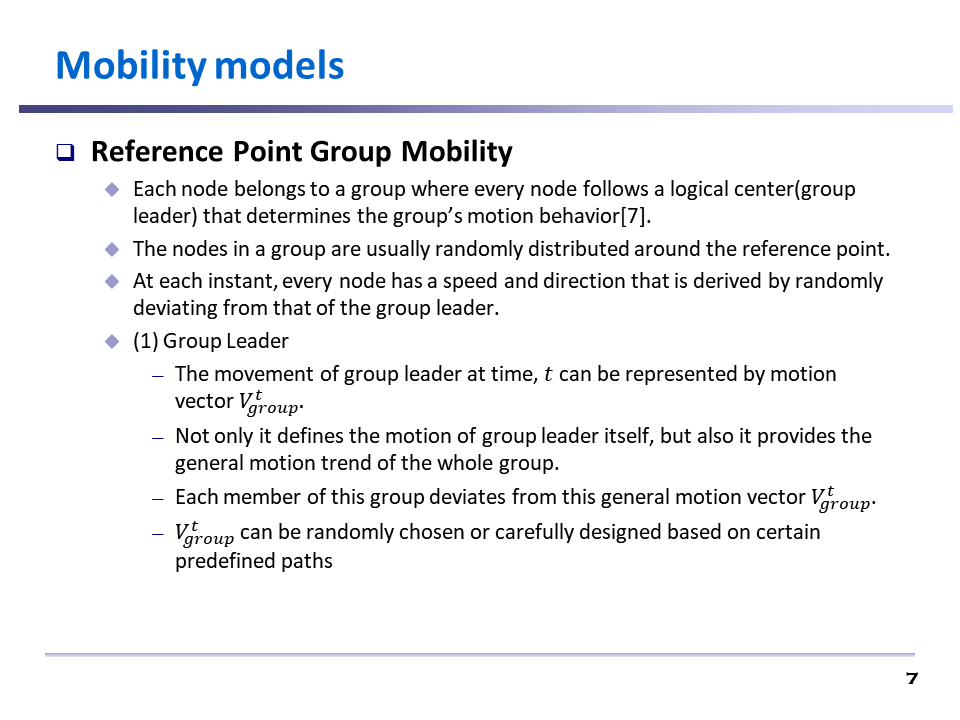  
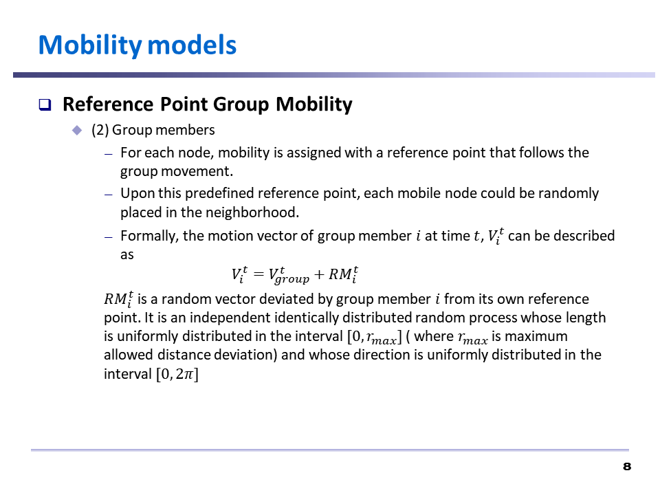  

 

* 구현을 위한 설계  

  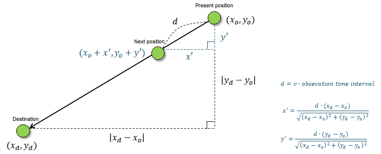  

    * 객체의 현재 위치, 임의의 목적지, 임의의 속도가 주어졌을 때 관측 시간 간격에 따라서 객체의 다음 위치에 대해서 결정해야 한다.  

    * 객체가 이동하는 거리에 대해서는 객체의 이동 속도와 관측 시간 간격을 곱하여 구할 수 있다.  

    * 피타고라스 정리를 이용하여 이동 거리에 따라서 다음 위치를 결정할 수 있다.  

  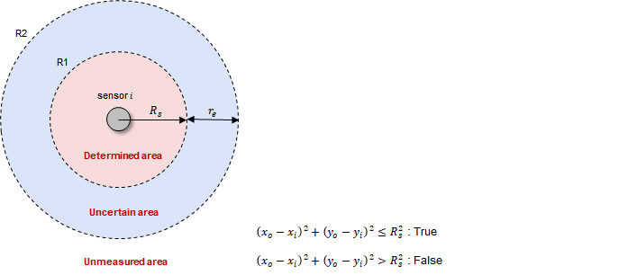

  * 센서 노드의 위치와 객체의 위치 정보를 이용하여 센서 노드가 객체를 감지했는지 여부에 대해서 계산한다.
  
  * 이렇게 만들어진 센서 노드의 위치와, 센서 노드의 객체 감지 여부를 이용하여 **RNN 모델의 입력 데이터**를 만들 수 있다.  

  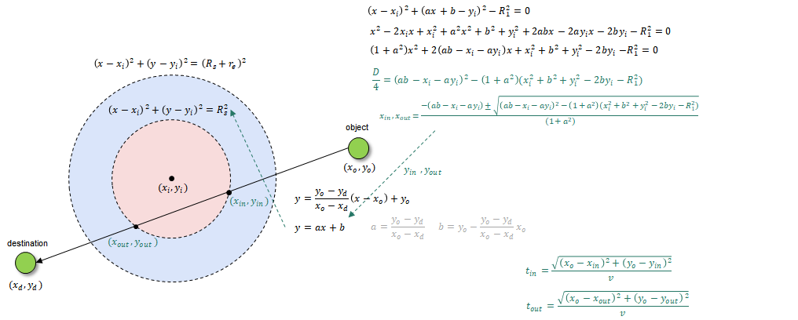    

  * 객체가 센서 노드의 커버리지를 지나가는데 걸리는 시간을 이용하여 최적의 듀티 사이클 모드를 계산한다. 이를 위해서 시뮬레이션에서 객체가 센서 노드를 지나가는데 걸리는 시간을 추출해야한다.  
  
  * 위와 그림과 같은 과정을 통해 수학적으로 구한다. 
   
  * 객체의 위치 정보, 객체가 센서 노드의 커버리지를 지나가는데 걸리는 시간을 제안한 최적 듀티 사이클 모드 계산 방법에 적용하여 **RNN 모델의 출력 데이터인 최적 듀티 사이클 모드**를 결정한다.   

 

* 구현 결과    

  * 센서 노드를 무작위로 배치하는 경우  

  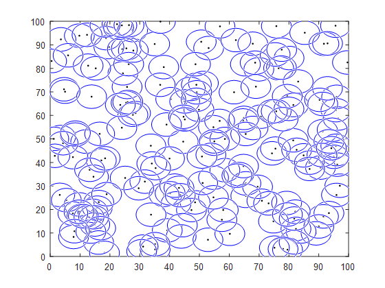     

  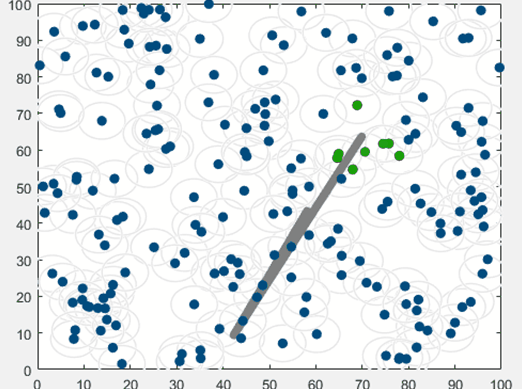  

  * 센서 노드를 겹치지 않고 일정 간격으로 배치하는 경우

  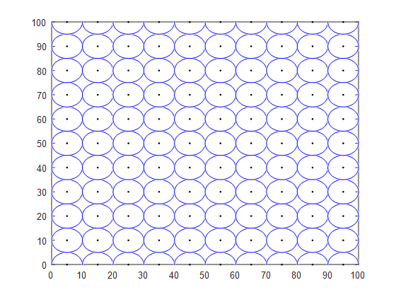  

  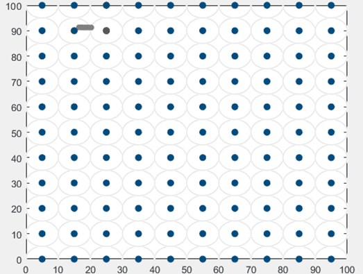  

  * 센서 노드가 겹치면서 일정 간격으로 배치하는 경우

  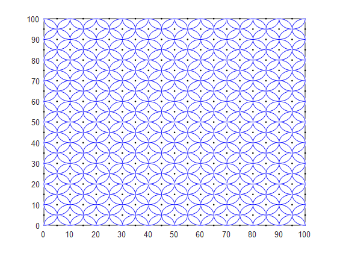  

  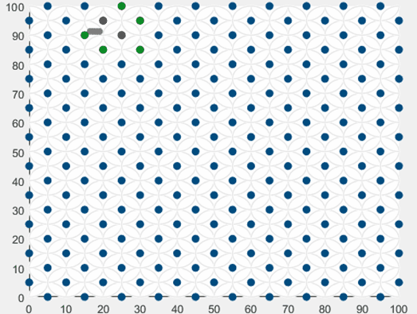  

 

#### LSTM 모델의 성능 개선  

* 테스트를 위해 간단한 LSTM 모델 구현  

  * 맨 처음 LSTM 모델의 정확도는 약 15%로 성능이 랜덤 듀티 사이클 모드를 선택하는 것과 다를 바가 없었다. 복잡한 시뮬레이션 환경에서는 문제의 원인을 알아내기 쉽지 않다고 판단하여 간단한 구조의 테스트 환경을 만들었다.

  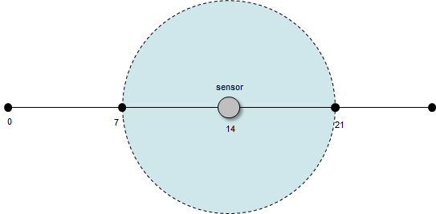  

  * 위와 같은 그림처럼 하나의 센서 노드 환경에서 테스트를 진행하는 환경이다. 시뮬레이션에 사용한 LSTM 모델을 그대로 사용하여 문제의 원인이 LSTM 모델에 있는지에 대해서 판단하고자 하였다.

  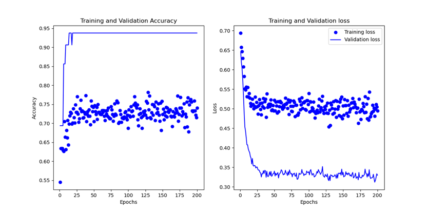  

  * 위와 같은 결과가 나왔다. 90퍼센트 대의 정확도가 나오는 것을 보아 LSTM 모델 구현 자체의 문제는 아니라고 판단할 수 있었다. **LSTM 모델이 구조상으로 복잡해진 데이터에서 적절한 대응이 안 되는 것**이라고 판단했다.
  
  *  90% 대의 정확도도 높은 편이기는 하지만 더 높은 정확도가 나오지 못하는 이유에 대해서 고민해보았다.

  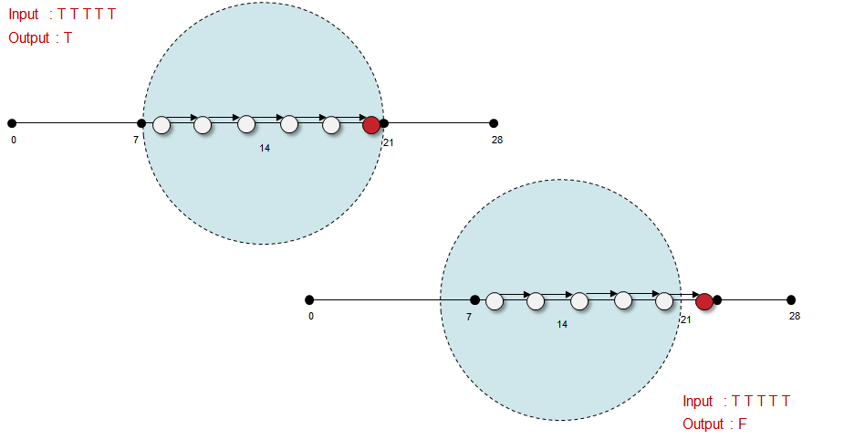  

  * 위와 같은 경우가 문제가 된다고 생각했다. 기본적으로 센서 노드는 객체를 감지했는지 아닌지에 대해서만 감지할 수 있다. 이 과정에서 객체의 위치가 추상적으로 변하는 문제가 생긴다. 이 부분을 극복하기 위해서는 센서 노드들이 충분히 오버랩되어 **입력에 대한 다양성**을 만들어야한다고 생각했다.

   

* LSTM 모델 구조의 수정 및 디지털 트윈 구조 수정으로 성능 개선

  * LSTM 모델 구조 수정
    * 심층 신경망 수업에서 교수님이 지나가며 요즘 대부분 딥러닝 모델의 경우에는 Batch Normalization이 필수적이라는 말씀을 하셨다. 이를 놓치지 않고 모델에 추가하여 LSTM 모델 구조를 수정하니 정말 정확도가 개선되는 것을 볼 수 있었다. 
      * Batch Normalization은 각 Batch 단위 별로 Normalization을 진행하는 것을 의미한다. Batch에 따라서, 혹은 layer에 따라서 입력 데이터의 분포가 다를 수 있지만 Normalization을 통해 분포를 균일화한다.
    
  * 디지털 트윈 구조 수정
    * Random Waypoint model에는 치명적인 단점이 있었다. Random이라는 것이 공평하게 일어날 것 같지만 그렇지 않다는 점이다. [1] Sequential data에 적용된 Random Waypoint Model은 시간이 지날수록 평균 속력이 낮아진다. 무작위로 속력을 선택하기는 하지만 느린 속력을 선택한 경우 목적지까지 도달하는데 오랜 시간이 걸리기 때문에 전체 데이터에서 느린 속력에 대한 데이터의 지분이 많아지는 문제가 발생하기 때문이다. 이는 결국 데이터셋의 불균형을 불러온다.
    * 또한 구조상 객체가 필드의 중앙 쪽을 지나가는 데이터가 많아지고 가장자리를 지나가는 데이터는 적어질 수 밖에 없다.
    * 이를 해소하기 위하여 RNN 모델의 특성에 집중하였다. RNN 모델은 고정된 길이의 sequential data를 입력으로 사용한다. 즉, 하나의 데이터는 sequential length만큼이면 충분하다. 따라서 목적지에 도착할 때까지가 아니라 sequential length가 채워지면 **새로운 시작점과 목적지와 속력**을 선택한다. 시작점도 바꾸는 이유는 중앙 쪽에 밀집될 수 밖에 없는 데이터를 조금이나마 더 분산시키기 위함이다.
    * 그리고 전체 Field를 partition하여 학습을 진행한다. 각각 센서 노드의 상황에 대한 데이터를 충분히 확보하기 위함이다. 또한 이렇게 설정함으로써 객체가 움직일 수 있는 범위를 센서 노드들이 배치된 곳보다 조금 더 크게 설정할 수 있다. 이를 통해 가장자리 쪽의 데이터를 충분히 확보할 수 있다.

 

[1] Yoon, Jungkeun, Mingyan Liu, and Brian Noble. "Random waypoint considered harmful." *IEEE INFOCOM 2003. Twenty-second Annual Joint Conference of the IEEE Computer and Communications Societies (IEEE Cat. No. 03CH37428)*. Vol. 2. IEEE, 2003.
